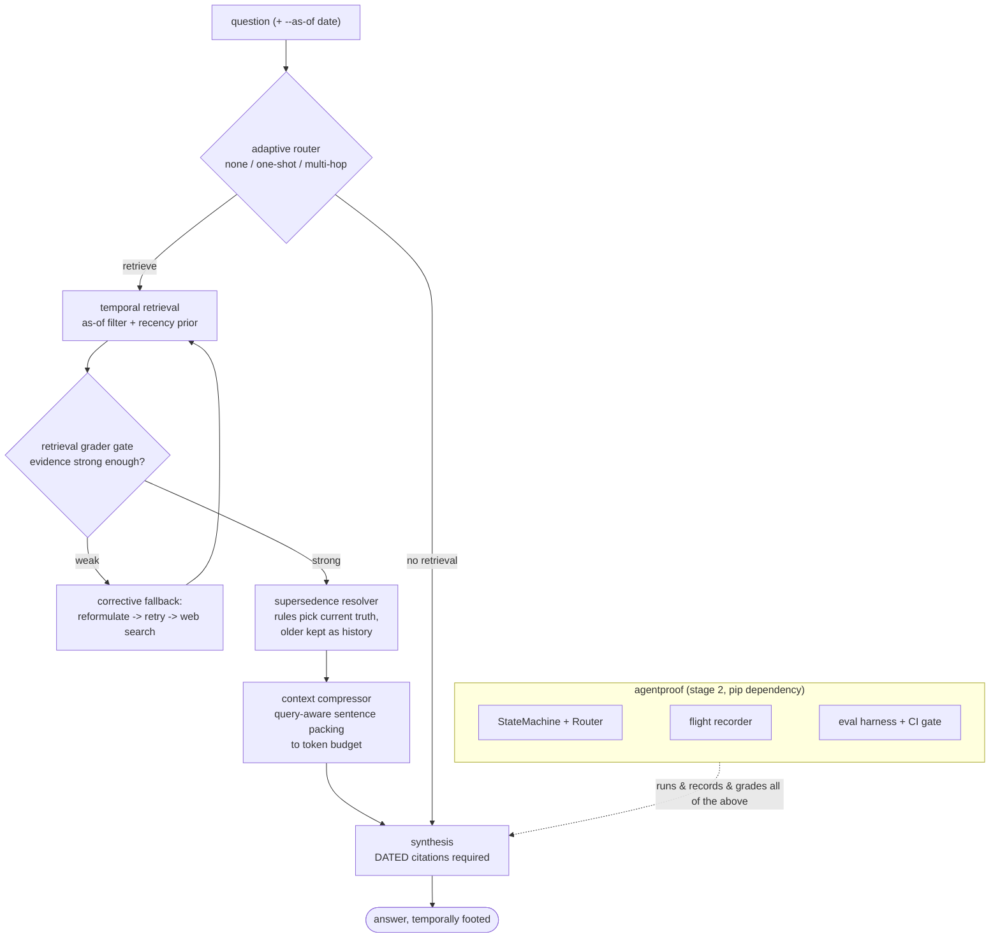

# GroundProof

> **RAG that knows when facts expire — and pays only for the context it needs.**

[](https://github.com/HelloJahid/GroundProof/actions/workflows/ci.yaml)
[](https://www.python.org/downloads/)
[](LICENSE)
[](https://github.com/astral-sh/ruff)

GroundProof is an **agentic corrective RAG** system with two hooks most RAG tutorials skip, both *proven* by an eval harness rather than asserted:

- **Time-aware retrieval** — every chunk carries `observed_at`; every query runs *as of* a moment (`--as-of 2024-06` vs today); conflicting facts are resolved by deterministic supersedence rules (later date wins, older kept as dated history); answers must carry dated citations.
- **Query-aware compression** — between retrieval and synthesis, sentences are scored against the question and knapsack-packed into a token budget with per-sentence source attribution preserved. The A/B receipts: **~62% fewer prompt tokens, evidence retention unchanged.**

Stage 3 of the Proof series — built ON the [AgentProof](https://github.com/HelloJahid/AgentProof) runtime (state machine, tool airlock, flight recorder, eval harness) and graded BY it. Stage 1: [PromptProof](https://github.com/HelloJahid/PromptProof).

## Architecture



Every pipeline box is an AgentProof `Step`; every run leaves a crash-safe trace; every claim below maps to a command.

## Quickstart

Python 3.11+. Fully offline by default — no API keys, no network (the corpus is committed).

```bash
git clone https://github.com/HelloJahid/GroundProof.git
cd GroundProof
python -m venv .venv
source .venv/bin/activate        # Windows: .venv\Scripts\activate
pip install -e ".[dev]"

pytest                           # full suite, fully mocked — no keys, no network
python -m groundproof.evals      # the eval gate: golden pairs + A/B receipts
```

## The three demo moments

**1. Time travel** — same question, two moments, two correctly-dated answers:

```bash
python -m demo.ask "summary release highlights latest stable python" --as-of 2024-06
#   -> evidence from (2023-10-02, python-whatsnew-3.12)
python -m demo.ask "summary release highlights latest stable python" --as-of 2026-01
#   -> evidence from (2025-10-07, python-whatsnew-3.14)
```

Every run prints the cockpit view — route, dated evidence, grade signals, compression stats — and leaves a trace you can replay:

```text
=== GroundProof cockpit — run 2347d06dfdb2 ===
question: "is the distutils package removed"
[1] route (0.1 ms): one_shot   (as-of: 2024-06-01)
[2] retrieve (16.0 ms): attempt 1, 5 current + 0 superseded
      0.463 (sim 0.39 rec 0.63)  2023-10-02  python-whatsnew-3.12  Changes in the Python API
      ...
[3] grade (0.8 ms): STRONG  strength=0.70  (similarity 0.39, overlap 1.00)
[4] compress (3.9 ms): 1288 -> 580 tokens (55% saved), kept 22/64 sentences, attribution preserved
[5] synthesize (0.1 ms)

answer:
  (2023-10-02, python-whatsnew-3.12): * :pep:`632`: Remove the :mod:`!distutils` package.
```

```bash
python -m groundproof.cockpit runs/ask-<id>.trace.jsonl   # replay any run from its trace
```

**2. Stale-fact catch** — add a superseding document to the corpus and the eval gate goes red, naming the case:

```text
FAIL expected_source: expected top evidence from python-whatsnew-3.14, got
python-whatsnew-3.15 — the corpus has changed what this question retrieves
eval gate: FAIL -- broken cases: latest-2026-01
```

**3. Compression receipts** — the A/B harness runs every golden case compressed and uncompressed:

```text
case                           tokens off->on   saved    retention off->on
distutils-removed               1360 -> 602       56%        1.00 -> 1.00
zoneinfo-added                  1433 -> 622       57%        1.00 -> 1.00
pattern-matching                1699 -> 621       63%        1.00 -> 1.00
fstring-changes                 2105 -> 613       71%        1.00 -> 1.00
mean savings: 62%   retention: intact
```

## Live mode

`--live` swaps the offline extractive synthesizer for the real model and web fallback through the same ports — put keys in `.env`:

```
ANTHROPIC_API_KEY=...
TAVILY_API_KEY=...
```

```bash
python -m demo.ask "is distutils available" --as-of today --live
```

## Layout

```
groundproof/
  ingest/       # fetcher, parser, reST chunker; Document/Chunk with observed_at
  retrieval/    # EmbeddingClient + VectorStore ports (mock + Chroma),
                # as-of filtering, recency prior, supersedence resolver
  grading/      # rule-based retrieval grader gate
  compress/     # query-aware sentence pruner, token-budget knapsack
  steps/        # the pipeline as AgentProof Steps + the corrective router
  evals/        # temporal golden pairs, A/B harness, CI gate (python -m groundproof.evals)
  cockpit.py    # GroundProof-aware trace viewer
demo/           # the ask CLI (offline by default, --live for real model + search)
corpus/         # committed CPython changelog corpus (Python 3.8-3.14, dated)
datasets/       # golden eval cases (JSONL)
tests/          # full offline suite — no keys, no network, ever
```

## Design rules

- Ports everywhere: embeddings, vector store, model, web transport are injectable protocols with first-class mocks — the entire test suite and eval gate run offline.
- Freshness is a gate check, not a judgment call: supersedence and as-of filtering are deterministic rules; the LLM is never asked to track what is current.
- If it isn't in the trace, it didn't happen: every run is recorded; evals judge traces, never live processes.
- No agent/RAG frameworks — the runtime is [AgentProof](https://github.com/HelloJahid/AgentProof); peripherals are `chromadb` and `httpx`.

## Contributing

Issues and small PRs are welcome — see [CONTRIBUTING.md](CONTRIBUTING.md) for the dev setup and the three checks every change must pass.

## License

[MIT](LICENSE)
